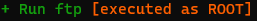
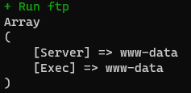
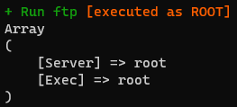

# Module Permissions
[Daemon](https://github.com/fruithost/Binary)-scripts of the modules (`setup/install.php` & `setup/deinstall.php` as well as `daemon.php`) are executed with the user web server by default. However, some operators may need extended access (root rights).

Since `Version 1.0.1`, these files can be marked with additional parameters ([Shebang](https://en.wikipedia.org/wiki/Shebang_(Unix))). As a result, these [daemon](https://github.com/fruithost/Binary) scripts are executed with root rights.

Set the following [Shebang](https://en.wikipedia.org/wiki/Shebang_(Unix)) at the beginning of the line so that the script is executed with extended rights:
> #!fruithost:permission:root

When the [Daemon](https://github.com/fruithost/Binary) is running, the modules that are running **with extended rights** are marked:



## Example
#### Normal execution
```php
<?php
    /*
        Will be executed by webserver (user "www-data")
    */
	
    print_r([
		'Server'	=> $_SERVER['USER'],
		'Exec'		=> exec('whoami')
	]);
?>
```
##### Output


#### Execution with root rights
```php
#!fruithost:permission:root
<?php
    /*
        Will be executed by webserver (user "root")
    */

	print_r([
		'Server'	=> $_SERVER['USER'],
		'Exec'		=> exec('whoami')
	]);
?>
```
##### Output

